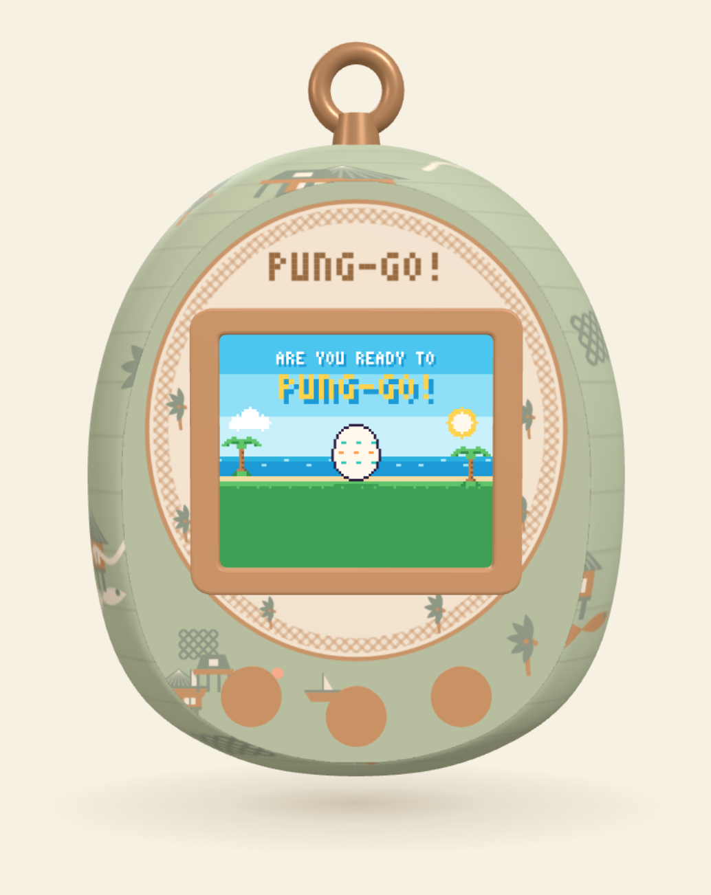

# Punggol Heritage Tamagotchi

A playable virtual Tamagotchi that raises a kampong child into a skilled Punggol
resident. Built for a design-innovation module as the interactive prototype of a
heritage-trail concept: each station along the trail carries a QR code, and
scanning it opens a minigame drawn from what people actually did there — tapping
rubber, mending a kelong net, catching seafood off Punggol Point.

**No build step, no framework, no dependencies to install.** Open `index.html` and
it runs. The only external script is Three.js from a CDN.



---

## Running it

```bash
git clone https://github.com/<you>/punggol-tamagotchi.git
cd punggol-tamagotchi
python3 -m http.server 8000     # any static server will do
```

Then open <http://localhost:8000>.

A server is needed only because ES modules are subject to CORS, which blocks
`file://`. Nothing is compiled, bundled or transpiled.

### Hosting on GitHub Pages

Push the repository and turn Pages on for the default branch, root folder. The
empty `.nojekyll` file at the root matters: without it Jekyll would quietly
ignore some paths, and the module imports would 404.

### Controls

| Input | Action |
| --- | --- |
| <kbd>←</kbd> | Select — move the cursor, and steer left in the fishing game |
| <kbd>Enter</kbd> | Confirm |
| <kbd>→</kbd> / <kbd>Esc</kbd> | Back — and steer right in the fishing game |
| <kbd>1</kbd> <kbd>2</kbd> <kbd>3</kbd> | Simulate scanning a station's QR code |
| drag | Turn the toy |

The three buttons on the toy itself are clickable; they are real 3D meshes, hit
tested with a raycaster. `index.html#point` opens a station directly, which is
what a scanned QR code would do.

---

## Architecture

```
punggol-tamagotchi/
├── index.html          markup only — one <script type="module">
├── styles.css          the page around the toy
├── .nojekyll           stops GitHub Pages hiding /src
└── src/
    ├── config.js       tuning values, packed colour palette, shell themes
    ├── data.js         items, recipes, stations, stories, stages, trades, menus
    ├── sprites.js      bitmap font, sprite table, procedural sprite generators
    ├── audio.js        Web Audio synthesis
    ├── state.js        the game — save state, inventory, progression, sessions
    ├── graphics.js     the Uint32Array framebuffer and its primitives
    ├── screens.js      one draw function per mode, plus the router
    ├── logic.js        press() input routing and update() simulation
    ├── device3d.js     all Three.js: geometry, textures, materials, pointer
    ├── gallery.js      the DOM character and shell picker cards
    └── main.js         composition root — wiring and the frame loop
```

### The dependency rule

Modules import only from modules above them in that list. There are no cycles
and no circular-import workarounds anywhere in the project.

```
config ──► data ──► sprites ──► audio ──► state ──► graphics ──► screens ──┐
                                            │                               │
                                            └──────────► logic ◄────────────┘
                                                            │
  device3d ──┐                                              │
  gallery  ──┼──────────────────► main.js ◄─────────────────┘
```

`main.js` is the only module that knows about all the others. That is what makes
every other file readable on its own, and what let the renderer be swapped for a
flat 2D fallback without touching a line of game code.

### Separation of concerns

The split that matters most is between **what the game is** and **how it is
shown**:

- **`state.js` has no DOM and no WebGL.** It owns three objects — `S` (what the
  player has earned and what gets saved), `ui` (selection and animation clocks,
  never saved) and `session` (the running minigame). It could be loaded in Node
  and stepped through a whole playthrough with no browser at all.
- **`logic.js` reads and writes those three objects and nothing else.** `press()`
  routes a button to the handler for the current mode; `update(dt)` advances
  needs, timers and minigame physics. Neither touches a pixel.
- **`graphics.js` owns the framebuffer and is the only module allowed to write
  to it.** It exposes primitives — `px`, `rect`, `sprite`, `text`, `statBar` —
  and knows nothing about game modes.
- **`screens.js` composes those primitives into one function per mode.** Every
  function is a pure consumer: it reads state, it never mutates it. That is what
  lets the screen repaint at 40fps while the simulation runs every frame.
- **`device3d.js` contains every WebGL concern in the project.** The game never
  learns that a 3D toy exists; it fills a 112×96 buffer, and `main.js` hands that
  buffer to whichever renderer came up.

All three state containers are exported as `const` objects and mutated in place
rather than reassigned, so every importing module keeps a valid reference for the
life of the page. `resetState()` deletes and refills `S`'s keys instead of
replacing the binding.

---

## How the interesting parts work

### The pixel renderer

The screen is a 112×96 canvas, but nothing is ever drawn with a canvas call. The
`ImageData` buffer is aliased as a `Uint32Array`, so setting a pixel is a single
array write:

```js
const image = ctx.createImageData(W, H);
const buf = new Uint32Array(image.data.buffer);

export function px(x, y, color) {
  x |= 0; y |= 0;
  if (x < 0 || y < 0 || x >= W || y >= H) return;
  buf[y * W + x] = color;
}
```

Every colour is pre-packed once at startup into the little-endian `0xAABBGGRR`
word that layout expects, so drawing never parses a hex string:

```js
export function packColor(hex) {
  const n = parseInt(hex.slice(1), 16);
  return (255 << 24) | ((n & 255) << 16) | (((n >> 8) & 255) << 8) | ((n >> 16) & 255);
}
```

A full-screen repaint is about 10,700 writes into a typed array, which is why it
holds 40fps comfortably alongside a WebGL render on the same frame.

### Sprites as strings

There are no image files anywhere in the project. A sprite is an array of
equal-length strings, where each character is a palette key and `.` is
transparent:

```js
egg: [
  '.........KKKKKK.........',
  '.......KKNNNNNNKK.......',
  '......KNNNNNNNNNNK......',
  ...
]
```

Storing art this way means it can be transformed with ordinary string
operations, and that is how most of the art in the game actually gets made.
`sprites.js` ships a handful of authored sprites and then **derives the rest at
load time**:

- **Six outfits** — singlet / short sleeve / long sleeve crossed with shorts /
  long trousers — assembled from a shared head and nine row constants, so no two
  of the six trades dress alike and none of them were drawn.
- **A walk frame for every one of them**, by substituting any row that reads as a
  pair of legs for its wider-apart twin. Because it is a substitution rather than
  a per-sprite edit, it works on outfits that did not exist when the table was
  written.
- **A sleeping head**, by closing one row of the eyes.
- **The entire hatching cutscene**, from the one egg sprite: a seam function
  defines a jagged line across its belly, `carve()` darkens the shell along a
  span of that seam for the three crack stages, and the same function splits the
  egg into two movable halves.

```js
const seam = (x) => 17 + ((x % 4) < 2 ? -1 : 1);   // the line it will break along

SPR.egg1 = carve(9, 14);    // a short crack
SPR.egg2 = carve(6, 17);    // spreading
SPR.egg3 = carve(3, 20, …); // about to give
```

Recolouring works the same way. The `sprite()` function takes a per-character
override map, so one body sprite wears every shirt in the game:

```js
sprite(currentBodySprite(), x, y, { C: COL[trade.shirt], c: COL[trade.sh] });
```

### The 3D shell

Three decisions in `device3d.js` are worth reading the comments for, because each
one fixes a specific visible problem:

**The egg is planed flat.** A flat screen cannot sit flush on a curved shell — it
protrudes. The body is a `LatheGeometry` whose front and back vertices are then
clamped to a plane before normals are recomputed, giving the screen a genuinely
flat face to recess into:

```js
const eggGeo = new THREE.LatheGeometry(pts, 120);
eggGeo.scale(1, 1, 0.56);
const pos = eggGeo.attributes.position;
for (let i = 0; i < pos.count; i++) {
  let z = pos.getZ(i);
  if (z > FLAT_FRONT_Z) z = FLAT_FRONT_Z;
  else if (z < -FLAT_BACK_Z) z = -FLAT_BACK_Z;
  pos.setZ(i, z);
}
pos.needsUpdate = true;
eggGeo.computeVertexNormals();
```

The window itself is an `ExtrudeGeometry` built from a rounded rectangle with a
rounded-rectangle hole, sunk into that face as a rim ring.

**The screen is supersampled before upload.** At 1:1 the 112×96 grid lands on
fractional texels and the pixel art smears unevenly. It is blown up 4× with
`imageSmoothingEnabled = false` first, so every game pixel covers a whole number
of texels.

**Colours are converted to linear.** The renderer outputs sRGB, so a raw hex
assigned to a material is interpreted as linear and comes out washed out. Every
material colour goes through `linearColor()`, which is why the four shell themes
read as the palettes they were picked from.

The four collectible shells are a theme object each. `applyShell()` repaints the
whole toy by copying a palette into the live `KAMPONG` theme, regenerating both
textures and disposing the old ones — they are 1024px canvases, and leaking them
is not free. The motif painters never learn which shell is selected; they read
the live theme.

### Audio

No audio files either. Each cue is a short oscillator with an exponential gain
envelope, built on demand. The `AudioContext` is created lazily from a user
gesture, because browsers refuse to start one otherwise, and every call is
wrapped so that a failed cue can never break a frame.

### Persistence, and the bug that shaped it

Saves are JSON in `localStorage`. The interesting part is `sanitize()`, which
exists because of a real failure: a build that renamed some story ids left older
saves holding ids the new build did not know. The lookup threw mid-frame, the
exception escaped `requestAnimationFrame`, the loop was never rescheduled, and
the toy froze with no way back.

Two defences came out of that, and both are still here:

```js
// state.js — anything unrecognised is dropped, not trusted
S.stories = (Array.isArray(S.stories) ? S.stories : []).filter((id) => !!STORYMAP[id]);
S.collected = (Array.isArray(S.collected) ? S.collected : []).filter((id) => !!TRADES[id]);
```

```js
// main.js — a bad frame costs one frame, not the session
function frame(now) {
  try { step(now); } catch (err) {
    console.error('frame error, recovering', err);
    try { session.pending = null; session.game = null; ui.story = null; go('home'); } catch (e) {}
  }
  requestAnimationFrame(frame);
}
```

### The frame loop

`main.js` runs one `requestAnimationFrame` loop with three different rates:

| Work | Rate | Why |
| --- | --- | --- |
| `update(dt)` | every frame | physics and input latency want the full rate |
| `draw()` | 40fps | a Tamagotchi screen gains nothing from 60 |
| texture upload + 3D render | only when painting **or** moving | a still toy showing an unchanged screen costs no GPU time |
| `save()` | every 4s | and on every meaningful action |

`dt` is clamped to 50ms, so a backgrounded tab cannot fast-forward the
simulation when it comes back.

### Graceful degradation

If `window.THREE` is missing or WebGL fails, `main.js` catches it, mounts a flat
2D canvas and copies the same framebuffer into it. The game is unaffected — it
never knew which renderer it had.

---

## Tech stack

HTML5 · CSS · vanilla JavaScript (ES modules) · Three.js r128 (WebGL) ·
Canvas 2D · Web Audio API · localStorage

No bundler, no transpiler, no package manager, no runtime dependencies.

---

## Credits

Historical content researched from [Roots.gov.sg](https://www.roots.gov.sg),
[BiblioAsia](https://biblioasia.nlb.gov.sg), NLB Infopedia, RememberSingapore and
Wikipedia.

Built as the Session 4 prototype for a university design-innovation module.
